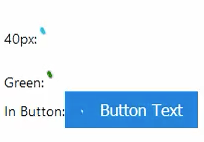

# @nozzlegear/react-svg-progress

An indefinite circular progress inspired by Google's progress indicator. Based off of https://github.com/nathanhoad/react-loading-animation.



## Installation

With [Yarn](https://github.com/yarnpkg/yarn):

```shell
yarn install @nozzlegear/react-svg-progress
```

Or from [NPM](https://npmjs.com/package/@nozzlegear/react-svg-progress):

```shell
npm install @nozzlegear/react-svg-progress --save
```

## Importing

The component can be imported like so:

```js
import { CircularProgress } from "@nozzlegear/react-svg-progress";
import CircularProgress from "@nozzlegear/react-svg-progress";
```

## Example

```js
import CircularProgress from "@nozzlegear/react-svg-progress";

function MyComponent() {
    return (
        <div>
            <div>
                {`40px:`}
                <CircularProgress size={40} strokeWidth={7} />
            </div>
            <div>
                {`Green:`}
                <CircularProgress size={40} color={"green"} />
            </div>
            <div>
                {`In Button:`}
                <button className={`btn blue`} >
                    <CircularProgress size={15} margin={"0 5px 0 0"} color={`#ffffff`} />
                    {`Button Text`}
                </button>
            </div>
        </div>
    )
}
```

## Props

Note: react-svg-progress has full TypeScript definitions! You should automatically receive intellisense for all of the props documented below:

| Name | Type | Required | Default | Description |
|------|------|----------|---------|-------------|
| `color` | string | false | `'#00bcd4'` | The progress indicator's color. Must be a valid CSS color string. |
| `size` | number or string | false | `16` | A number or string designating the size of the SVG. If a string, the property must be a valid CSS height and width value. |
| `margin` | string | false | `undefined` | A valid CSS margin string. |
| `strokeWidth` | number | false | 5 | Stroke width of the progress indicator. |
